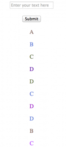
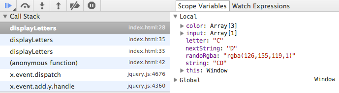
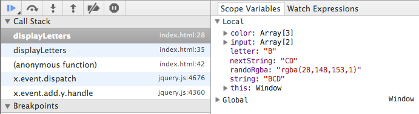
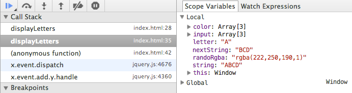

Understanding a stack trace is an essential skill for any software developer. In this post, I'll show you how to read a stack trace and give an example of how to use a stack trace to debug client-side JavaScript.<span class="more" />

A **stack trace** is a snapshot of a program at a specific moment during a its runtime. It gives you access to useful information about the execution of your code, like:
  * The call stack
  * Closure scope
  * Local variables

## Our Example


We'll be adding some simple functionality to a basic webpage. I won't focus too much on the HTML or CSS, let's assume those are ready. Here's where we'll start:

``` html
<script src="http://cdnjs.cloudflare.com/ajax/libs/jquery/2.0.3/jquery.min.js"></script>
<script src="http://cdnjs.cloudflare.com/ajax/libs/underscore.js/1.5.2/underscore-min.js"></script>
<script>
  $(function() {
    $('form').submit(function(evt) {
      evt.preventDefault();
      console.log('Form submitted:', $(this).find('input').val() );
      $(this).find('input').val('');
    })
  })
</script>

<form>
  <p><input type="text" placeholder="Enter your text here" /></p>
  <p><button>Submit</button></p>
</form>
<div class="letter-display"></div>
```

This simple example logs whatever is in the input field whenever the button is clicked, and then clears the input field. Not much to it, right?


## Time To Get Funky


Now lets step it up a notch and append the form input to the page, one letter per line, AND give each letter a random color.

Here's one way you could modify the inline `script` tag to implement this behavior:

``` javascript
// Lets setup a funky (and broken) function that will iterate though a string, and append each letter to the page with a random color
var displayLetters = function(string) {
  var input = string.split('');
  var color = [0,0,0];

  // Iterate through r, g, and b and assign a random value
  _.each(color, function(code, i, color) {
    color[i] = Math.floor(Math.random() * 256);
  });

  while( input.length ) {
    // Append the letter and apply the color
    var letter = input.shift();
    var nextString = input.join('');
    var randoRgba = "rgba(" + color.join(',') + ",1)";

    $('.letter-display').append( $('<p />').text( letter ).css('color', randoRgba ) );
    displayLetters(nextString);
  }
};

$(function() {
  $('form').submit(function(evt) {
    evt.preventDefault();
    displayLetters( $(this).find('input').val() )
    console.log('Form submitted:', $(this).find('input').val() );
    $(this).find('input').val('');
  })
})
```

## Things Get Weird


The code looks good, but if you try it you'll notice that something is off...This is what I saw when I entered "ABCD":



**Uhh?**  The colors are nice and random, but there are way too many letters there! _(Note: I cropped the image, it actually went on a bit further)_

Now, if you're a seasoned JavaScript dev you'll be able to squash this bug in no time. This post's not for you.

If you were to run into this situation and think game over, I'd like to introduce you to my friend...`debugger`

### Chrome DevTools
My examples will point to specific features of Chrome's Developer Tools. Most browsers offer some form of debugging tools, natively or via extension, but I like Chrome's.


## The `debugger` Statement


Simply add a debugger to the part of your code that isn't meeting your expectations, fire open the Chrome Dev Tools (Command + Option + J on a Mac), and refresh the page.

```javascript
while( input.length ) {
  debugger;
  // Append the letter and apply the color
  var letter = input.shift();
  var nextString = input.join('');
  var randoRgba = "rgba(" + color.join(',') + ",1)";

  $('.letter-display').append( $('<p />').text( letter ).css('color', randoRgba ) );
  displayLetters(nextString);
}
```

Now, your script will pause execution when it hits this statement. In this case, that will happen once you submit some text in the form. The **Sources** panel has all kinds of information that will help you debug this code:

[debugger](debugger.png)

OK, that's a lot to take in there. Let's go through some of the components:


### DevTools Toolbar


These are your debugger 'home keys.' Know them. Use them. They will be good to you.

**The first 4 are the big ones**. From left to right they are:

  * **Resume Execution**. This one does what it says and un-pauses your script, until the `debugger` statement is hit again.
  * **Step Over**. Execute the current line (highlighted in blue) and proceed to the next line, but don't execute it yet.
  * **Step In**. If the current line calls a function, step into that function in the debugger.
  * **Step Out**. The opposite of _Step In_. Returns you to the function you stepped in _from._
  * Ignore Breakpoints. Disables pausing on breakpoints.
  * Ignore Exception. Disables pausing on exceptions.


### Fast Forward


I went ahead and hit the **Resume Execution** button four times and let the debugger stop there, because that's where my script stopped behaving as intended and things get interesting. My debugger looks like so now:




### Scope Variables


On the right are your scope variables _at this moment_ in the execution of this program (which is paused exactly where you want it). How very useful!

So lets see, nextString has a length of 1, so the next step _really should_ be the last iteration of the while loop, because after that input.length will be falsey, right? Well... we know the answer is no, because it clearly doesn't stop.


### Whats In Your Call Stack?


On the left is your **call stack**. It's kinda like the stack data structure, and represents the **last-in-first-out** execution order of functions that have been called. The _most recently called function_ is on top. Once a function finishes executing, it _pops_ off the top and allows the function that invoked it to resume execution.

**Clicking on a function in the call stack will show you the code that is 'paused', waiting for other functions to finish. It will also show you that function's local scope variables at that exact moment of execution.**

Lets see, displayLetters on top there, 3 times. It is a recursive function and calls itself, so that makes sense. But it doesn't stop when it is meant to..


## Using the Call Stack to Debug a Recursive Function


So, what's wrong with our function? Let's click **Resume Execution** one more time to see where it goes wrong:



What?! Why is nextString now "CD"? It was "D" the last time this function call hit the debugger. Let's click on the next function call in the stack and see what its scope looks like:



Remember, this is a snapshot of what the scope was **back in time**, when this function yielded execution to another function.

I think I see what's wrong now. **Do you?**


## Bubbling Functions


Once a function returns, it's caller resumes execution where it left off. In this case, that's in the middle of a while loop...

Intuitively, the code provided in this example might feel right. But when any of the child functions return, its parent function will continue its loop to the next letter, call itself, yield execution, and start this process over again.

The call stack can help you observe the processes going on during the execution of your JavaScript, and give you a snapshot of each function call.

In this case, its a pretty simple fix. Either our while loop is unnecessary, or the function should parse the input iteratevely, not recursively. Here's one quick solution, changing the while loop to an if statement:

``` javascript
if( input.length ) {
  // Append the letter and apply the color
  var letter = input.shift();
  var nextString = input.join('');
  var randoRgba = "rgba(" + color.join(',') + ",1)";

  $('.letter-display').append( $('<p />').text( letter ).css('color', randoRgba ) );
  displayLetters(nextString);
}
```


## In The Real World


The call stack and dev tools are invaluable tools that can make debugging much less of a hassle, and help you follow the execution of your program.

This was a super simple example, but the same concepts apply to any of your code. Now go debug your code!
