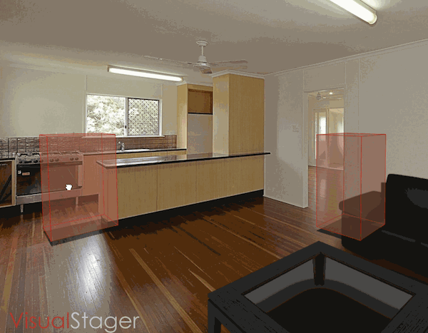

I just wrapped-up my Hack Reactor group project on Visual Stager.

We took an existing ~20,000 line codebase and dove right in, closing tickets along the way. Ultimately, we built a new feature that is now in beta. 

## Background

[Visual Stager](http://www.visualstager.com) is a tool that helps real estate agents, or anyone selling property, quickly stage furnished scenes for prospective buyers.

It is a complex, in-production, web application that utilizes a highly customized [Backbone.js](http://backbonejs.org/) frontend MVC, [Handlebars](http://handlebarsjs.com/) templates, [Stylus](http://learnboost.github.io/stylus/) CSS preprocessing, [THREE.js](http://threejs.org/) 3D rendering, a [Node.js](http://nodejs.org/) + [Express](http://expressjs.com/) server, and a [MongoDB](http://www.mongodb.org/) database.

## The Team

In addition to myself, Team Visual Stager consisted of [Kristina Brainwave](http://kbrainwave.github.io/), [Elie Kiwan](http://ekiwan.github.io/), [Ryan Stellar](http://www.linkedin.com/in/rstellar/) and [Curtis Mitchell](http://www.curt-mitch.net). Our amazing team lead was [Larry Davis](http://lazd.github.io/).

## My Role

I took on a full-stack role for this project, meaning I worked on both the front and back end of the application. I was comfortable with most of the stack so the first thing I did was open up my text editor and start reading code and learning the nuances of Visual Stager's custom Backbone implementation.

I had always wanted to learn more about geometry and 3D rendering, so I really challenged myself with my first ticket:

### Surface Item Height Adjustment UI

This is the essence of my primary contribution to Visual Stager. So much more is possible, but I didn't want to make you load a 10MB file. Sorry about the low quality/glitchy GIF.

Rest assured, this was not as simple as anything like:

[js]item.y += mouse.y;[/js]

This behavior involves complex math, tweaked to improve perceived experience, and firing lots of rays(!). This behavior works via either touch or click, and in combination with other behaviors,  in real-time.

I can't go into more detail due to to the company's proprietary technology, but I will do my best to entertain any [inquiries via email](http://nason.us/contact/). Needless to say, I learned an incredible amount while working on this particular issue.

### Workflow Automation

Visual Stager has a complex development environment and uses automation tools to keep its moving pieces active & in sync. I upgraded Visual Stager to use Grunt v0.4, which involved re-configuring watch, copy, concatenate, uglify, and compile tasks.

For a project this large and complicated, automation is critical so I invested my time making sure this upgrade went smoothly and improved our development workflow.

### Closing Tickets

I personally closed a handful of tickets during the 2 week project period. These ranged from UI enhancements and additions to squashing bugs, and everything in between.

Collectively our team closed around 20 issues during the project period, before starting work on our new feature...

## Tours

**My team built a sharable tour module that Visual Stager users can send to prospective property buyers. **It is a cross-browser compatible, touch enabled & responsively designed carousel of scene photos on the main axis, with scene variations on the y-axis.

Our main challenges while building this feature involved creating a custom data structure and an animation algorithm to power the view. It is still in beta, and should be pushed to production in the near future.

## Experience / Conclusion

This was a big project with a super team of developers with diverse backgrounds, and an awesome team lead. I learned a lot about complex, real world workflows including:

  * Jumping in and working on a large codebase
  * Daily standups
  * Collaborating with team members on difficult problems
  * Struggling with complex workflows
  * Git merge conflics
  * Quickly learning new technologies to complete tasks

Visual Stager was a really great experience. Check out the product at [www.visualstager.com](http://www.visualstager.com).
